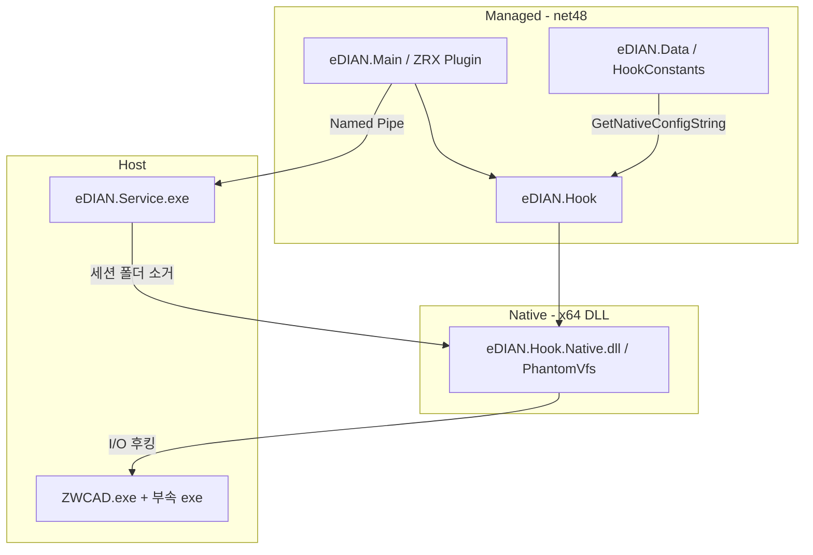

# ZWCAD 2026 Phase 2 — 가상화(VFS) 이관 로드맵

이 문서는 **eDIAN Plus for ZWCAD 2026** 솔루션에 AutoCAD 2026에서 운영 중인 **PhantomVfs 가상화 스택**(`eDIAN.Hook`, `eDIAN.Hook.Native`)을 이관·통합하기 위한 공식 개발 로드맵입니다.

| 항목 | 내용 |
|------|------|
| **전제** | Phase 1 **완료** — Managed 플러그인·MIP·팔레트·Service 동작 확인 (VFS 비활성) |
| **대상 저장소** | `D:\workspace_vs\eDIAN Plus for ZWCAD 2026` |
| **원본 저장소** | `D:\workspace_vs\eDIAN Plus for AutoCAD 2026` |
| **GitHub** | [eDIAN-Plus-for-ZWCAD-2026](https://github.com/leavesaction/eDIAN-Plus-for-ZWCAD-2026) |
| **관련 AutoCAD 로드맵** | `ROADMAP_PLUGIN_BASELINE.md` (5단계 ZWCAD 포팅 완료), `ROADMAP_STEALTH_VFS.md` (Native VFS 기능 기준) |

---

## 0. 핵심 원칙

- **분리 저장소**: ZWCAD 솔루션은 AutoCAD repo와 **별도 Git**이며, Phase 2도 ZWCAD repo에서만 진행한다.
- **Baseline First**: Hook/Native 이관 원본은 AutoCAD repo의 **검증된 커밋/태그**로 고정한다 (이관 시 해시 기록).
- **No Big Bang**: 빌드 연동 → Setup → `VfsInterceptor` 활성화 → 실측·튜닝을 **단계 분리**한다. 한 번에 Install까지 켜지 않는다.
- **ZWCAD Preserve (덮어쓰기 금지)**:
  - `PluginInitializer.preloadAssembly` (`Microsoft.IdentityModel.Abstractions` 8.16.0.0) + `app.config` bindingRedirect
  - `eDIAN.Setup.vdproj` — ZWSOFT 레지스트리, `bin\x64\Release` 배포 경로
  - **net48** / `packages.config` / ZWCAD `ZwSoft.*` HintPath — AutoCAD(net8) csproj·PackageReference **일괄 이관 금지**
- **승인 게이트** (`AGENTS.md`): Hook/Native 솔루션 추가, **Setup DLL 목록 변경**, `VfsInterceptor.Install()` 활성화는 **착수 전 사용자(박부장) 확인** 후 진행.

---

## 1. 목표와 범위

### 1.1 목표

| # | 목표 |
|---|------|
| G1 | `eDIAN.Hook` + `eDIAN.Hook.Native`를 ZWCAD 솔루션에 포함하고 **x64 Debug/Release 빌드** 성공 |
| G2 | `eDIAN.Main\bin\x64\{Configuration}\`에 `eDIAN.Hook.dll`, `eDIAN.Hook.Native.dll` 자동 배치 |
| G3 | MSI(`eDIAN.Setup`)에 Native/Hook DLL 포함 (ZWCAD 레지스트리·경로 유지) |
| G4 | ZWCAD에서 **dwl/tmp/plot/publish 임시 파일 가상화** 및 세션 종료 시 흔적 소거 실측 통과 |
| G5 | `HookConstants` ZWCAD 프로필을 **실측 데이터**로 검증·보정 |

### 1.2 In Scope

- `eDIAN.Hook` (Managed P/Invoke 래퍼, `VfsInterceptor`)
- `eDIAN.Hook.Native` (C++ PhantomVfs, Detours I/O 후킹)
- `eDIAN.Main` MSBuild Native 선행 빌드 타겟, 프로젝트 참조
- `eDIAN.Setup.vdproj` — Hook/Native DLL **추가만**
- `PluginApplication` — `VfsInterceptor.Install()` / `Uninstall()` 활성화
- `eDIAN.Data\HookConstants.cs` — ZWCAD 신뢰 프로세스·temp 패턴 실측 반영

### 1.3 Out of Scope (본 Phase 2 로드맵)

- AutoCAD 솔루션·net8 빌드 체계 변경
- AutoCAD `eDIAN.Setup.vdproj` 이관 또는 ZWCAD Setup **전체 교체**
- ANSI API(`CreateFileA` 등) 후킹 **신규 개발** (실측에서 필요 시 **별도 백로그**)
- PhantomVfs 엔진 **아키텍처 대개편** (Stealth VFS 1~4단계는 AutoCAD에서 완료, [ROADMAP_STEALTH_VFS.md](../eDIAN%20Plus%20for%20AutoCAD%202026/ROADMAP_STEALTH_VFS.md) 참고)

---

## 2. 현재 상태 (Phase 1 완료 기준)

| 항목 | 상태 |
|------|------|
| 솔루션 프로젝트 | Main, Data, Core, Service, Service.Core, Setup — **Hook/Native 없음** |
| `PARENT_PROGRAM_VERSION` | `"ZWCAD 2026"` (`CommonConstants.cs`) → `HookConstants.IsZWCAD()` **true** |
| `VfsInterceptor` | `PluginApplication.Initialize()` 내 **주석 처리** |
| `eDIAN.Hook` using | `ProtectionController`, `MainForm` 등 **주석** |
| Setup | `eDIAN.Hook.Native.dll` **미포함** |
| 실측 | MIP·팔레트·Service — **가상화 없이** 동작 확인 (2026-05-26) |

### 2.1 ZWCAD에 이미 준비된 설정 (`HookConstants.cs`)

| 항목 | ZWCAD 정의 (코드 초안) |
|------|------------------------|
| 호스트 | `ZWCAD.exe` |
| 신뢰 프로세스 | `ZwPublish.exe`, `ZwConsole.exe`, `ZwPlotters.exe`, … |
| temp 패턴 | `\temp\zwpubl~`, `\temp\zwplot~`, `\temp\zwpublish_`, `\temp\zwplot_` |

> Native `AccessGuard.cpp`에는 `zwcad.exe`, `zwpublish.exe` 등 **fallback**이 있으나, **신뢰 프로세스·temp 패턴의 정본은 ZWCAD 실측**이다.

---

## 3. 이관 아키텍처

| 레이어 | 역할 | CAD 종속성 |
|--------|------|------------|
| **Managed** | 기동, MIP, `VfsInterceptor.Install()`, 경로·로그 상수 | ZWCAD API (`ZwSoft.ZwCAD.*`) |
| **eDIAN.Hook** | P/Invoke, Native 초기화·후킹 설치 | 없음 |
| **eDIAN.Hook.Native** | Win32 I/O IAT 후킹, 세션 샌드박스, Keeper/Manifest | **없음** (설정 문자열만 CAD별) |
| **eDIAN.Service** | Pipe 단절 시 세션 디렉터리 정리 | 공통 |

**참고 문서 (AutoCAD repo, 읽기 전용)**:

| 문서 | 경로 |
|------|------|
| AutoCAD vs ZWCAD 호환성 | `..\eDIAN Plus for AutoCAD 2026\.document\[분석]AutoCAD 와 ZWCAD의 가상화 호환성 보고서.md` |
| VFS 설계 배경 | `..\eDIAN Plus for AutoCAD 2026\.document\[분석]VFS 가상화 설계 배경 및 기술 제약 분석.md` |
| Windows I/O 후킹 표 | `..\eDIAN Plus for AutoCAD 2026\.document\[분석]Windows_IO_API_Guide.md` |
| Stealth VFS 완료 기준 | `..\eDIAN Plus for AutoCAD 2026\ROADMAP_STEALTH_VFS.md` |
| ZWCAD 1단계 이관 완료 | `..\eDIAN Plus for AutoCAD 2026\ROADMAP_PLUGIN_BASELINE.md` §5단계 |

---

## 4. AutoCAD vs ZWCAD 이관 차이 (실수 방지)

| 항목 | AutoCAD 2026 | ZWCAD 2026 Phase 2 |
|------|--------------|---------------------|
| `eDIAN.Hook` TFM | `net8.0-windows` | **.NET Framework 4.8** (legacy csproj 또는 net48 SDK) |
| Main 출력 | `bin\x64\Release\net8.0-windows\` | `bin\x64\Release\` |
| Setup DLL 소스 | `...\net8.0-windows\eDIAN.Hook.Native.dll` | `..\eDIAN.Main\bin\x64\Release\` |
| Native config 런타임 | ACAD 프로필 (기본) | **ZWCAD 프로필** (`PARENT_PROGRAM_VERSION`에 `ZWCAD` 포함) |
| Setup | Autodesk 레지스트리 | **ZWSOFT vdproj 유지**, DLL만 추가 |

---

## 5. 단계별 로드맵

### 0단계 — 착수 승인·베이스라인 고정

- **목적**: 이관 원본·승인 범위·실측 환경 확정.
- **주요 작업**:
  - [x] 박부장 승인: **1~3단계**(Hook/Native·빌드·using, VFS 비활성). **4~5단계**(Setup·VFS ON)는 단계별 재확인 — [`PHASE2_KICKOFF_GATE.md`](./PHASE2_KICKOFF_GATE.md)
  - [x] AutoCAD repo **baseline 커밋 해시** 기록 — `e24afc9` (Hook/Native = `main` HEAD)
  - [x] ZWCAD 실측 PC: `ZWCAD.exe` **26.11.0.20039**, `C:\Program Files\ZWSOFT\ZWCAD 2026\` — Plot/Publish 시나리오는 §6 실측 시 수행
  - [x] Git 브랜치: `feature/phase2-vfs`
- **산출물**: §10 기록 + `PHASE2_KICKOFF_GATE.md`
- **상태**: **완료 (Completed)** — 2026-05-26

---

### 1단계 — 소스 이관 (프로젝트 추가, VFS 비활성)

- **목적**: ZWCAD 솔루션에 Hook/Native **소스만** 포함. `VfsInterceptor`는 **아직 주석**.
- **주요 작업**:
  - [x] AutoCAD `e24afc9`에서 복사: `eDIAN.Hook\`, `eDIAN.Hook.Native\` (detours 포함)
  - [x] `eDIAN.Hook.csproj` — **net48** 신규 (`UnmanagedCallersOnly` 제거)
  - [x] `eDIAN Plus for ZWCAD 2026.sln`에 두 프로젝트 등록
- **테스트 검증**:
  - [x] 솔루션 **Release \| x64** Rebuild 성공
  - [x] `eDIAN.Main\bin\x64\Release\` — `eDIAN.Hook.dll`, `eDIAN.Hook.Native.dll` 확인
- **상태**: **완료 (Completed)** — 2026-05-26

---

### 2단계 — 빌드 연동 (Main + MSBuild Native 타겟)

- **목적**: Main 빌드 시 Native DLL이 `bin\x64\{Configuration}\`에 자동 복사.
- **주요 작업**:
  - [x] `eDIAN.Main.csproj` — `ProjectReference` → `eDIAN.Hook`
  - [x] `BuildNativeHookDll`, `AddNativeHookToContent` (출력 `bin\x64\$(Configuration)\`)
  - [x] Native `OutDir` / `TargetName` — ZWCAD 경로 (`net8.0-windows` 없음)
- **테스트 검증**:
  - [x] Release \| x64 Rebuild 성공
  - [x] **Debug \| x64** 솔루션 Rebuild 성공 (박부장, 2026-05-26) — Native **1회** 빌드
  - [x] 출력 폴더에 Hook/Native DLL 존재
  - [ ] ZWCAD 로드 — **VFS 주석 유지** Phase 1 회귀 (박부장)
- **상태**: **빌드 완료** — ZWCAD 실기 로드 회귀 남음

---

### 3단계 — Managed 연결 (참조·using, Install 보류 가능)

- **목적**: 컴파일 의존성 정리. Install 활성화는 5단계와 분리 가능.
- **주요 작업**:
  - [x] `ProtectionController.cs`, `MainForm.xaml.cs` — `using eDIAN.Hook;`
  - [x] `PluginApplication` — `VfsInterceptor.Install()` / `Uninstall()` **주석 유지**
- **테스트 검증**:
  - [x] Release 빌드 성공
- **상태**: **완료 (Completed)** — 2026-05-26

---

### 4단계 — Setup 패키징 (승인 필요)

- **목적**: MSI에 Hook/Native DLL 포함. **ZWSOFT 레지스트리·경로는 변경하지 않음**.
- **주요 작업**:
  - [ ] `eDIAN.Setup.vdproj`에 파일 추가:
    - `eDIAN.Hook.dll`
    - `eDIAN.Hook.Native.dll`
  - [ ] `SourcePath`: `..\eDIAN.Main\bin\x64\Release\` ( **`net8.0-windows` 없음** )
  - [ ] Release Main 빌드 후 Setup 빌드 → `Release\eDIAN.Setup.msi`
- **테스트 검증**:
  - [ ] MSI 설치 후 플러그인 디렉터리에 두 DLL 존재
  - [ ] ZWCAD 레지스트리 로드 경로 회귀 없음
- **상태**: _대기_

---

### 5단계 — VFS 활성화

- **목적**: 런타임에 PhantomVfs 엔진 가동.
- **주요 작업**:
  - [ ] `PluginApplication.Initialize()` — `VfsInterceptor.Install();` 주석 해제
  - [ ] `Terminate()` — `VfsInterceptor.Uninstall();` 주석 해제
  - [ ] Debug 빌드로 ZWCAD 기동
- **테스트 검증** (로그):
  - [ ] `eDIAN.Main\bin\x64\Debug\logs\plugin.log` — `[VFS 3.0] Pure Memory Shield Engine Active.`
  - [ ] Native/VFS 로그 — 세션 난수 폴더 생성, `Process: ZWCAD.exe`, ZWCAD config 주입 확인
- **상태**: _대기_

---

### 6단계 — ZWCAD 실측·튜닝

- **목적**: 코드에 정의된 ZWCAD 프로필을 **현장 데이터**로 검증·보정.
- **호환성 매트릭스** (AutoCAD 호환성 보고서 H1~H10 요약):

| ID | 항목 | 조치 |
|----|------|------|
| H1 | Unicode I/O 후킹 | DWG/XREF/저장/Plot/Publish 시나리오 실측 |
| H2 | 플랫폼 config | `GetNativeConfigString()` → `ZWCAD.exe` 프로필 로그 확인 |
| H3 | 신뢰 프로세스 | Procmon으로 **실제 exe 명** 수집 → `ZWCAD_TRUSTED_PROCESSES` 수정 |
| H4 | temp/Manifest 패턴 | `%LocalAppData%\...\temp\` 샘플 → `ZWCAD_TEMP_PATTERNS` 수정 |
| H5 | `.zw$` / `.zs$` | 보호 DWG 잠금·스왑 파일 격리 확인 |
| H6 | ANSI API | 문제 재현 시 백로그 (`CreateFileA` 등) |
| H7 | `EDIAN_VFS_SESSION_DIR` | 부속 프로세스 환경 변수 상속 확인 |
| H8 | `CreateProcessW` | 자식 PID·로그 확인 |
| H9 | Keeper / JIT Manifest | 국산/ZRX 플러그인 Lock 충돌 QA |
| H10 | Service 연동 | Pipe 단절 후 세션 폴더 소거 (~600ms, [ROADMAP_STEALTH_VFS](../eDIAN%20Plus%20for%20AutoCAD%202026/ROADMAP_STEALTH_VFS.md) §4) |

- **회귀 테스트 체크리스트** (Phase 1 + VFS):

  - [ ] 플러그인 로드, `MainForm` 팔레트
  - [ ] MIP 로그인/로그아웃, 보호 DWG 열기·저장·닫기
  - [ ] 보호 문서 Save/Print/Publish/Copy 차단 (리본·명령)
  - [ ] `eDIAN.Service.exe` PING/PAUSE 및 종료 시 temp 세션 소거
  - [ ] dwl/dwl2/tmp/ac$/zw$/zs$ 등 **플러그인 temp 밖**에 원본 흔적 없음
  - [ ] ZWCAD **정상 종료** 및 **강제 종료** 후 세션 폴더 소거
  - [ ] (선택) 크래시 덤프·Procmon 캡처 아카이브

- **상태**: _대기_

---

### 7단계 — Baseline 고정 및 문서화

- **목적**: Phase 2 완료 스냅샷·운영 인수.
- **주요 작업**:
  - [ ] Git tag: `zwcad-vfs-phase2-complete` (이름 예시)
  - [ ] 본 문서 §10 «이관 원본 기록»·«완료 내역» 갱신
  - [ ] `AGENTS.md` — Phase 2 완료, Hook/Native 포함 반영
  - [ ] (선택) AutoCAD `.document` 중 ZWCAD 실측 결과만 ZWCAD repo에 요약본 추가
- **상태**: _대기_

---

## 6. PR / 커밋 분할 (권장)

| PR | 내용 | VFS Install | Setup |
|----|------|-------------|-------|
| **PR1** | Hook + Native 소스, sln 등록 | 비활성 | 변경 없음 |
| **PR2** | Main MSBuild + ProjectReference | 비활성 | 변경 없음 |
| **PR3** | vdproj DLL 2종 추가 | 비활성 | **승인 후** |
| **PR4** | `VfsInterceptor` 활성화 | **활성** | PR3 포함 가정 |
| **PR5** | `HookConstants` / Native 실측 보정 | 활성 | 필요 시 |

---

## 7. 빌드·배포 순서 (요약)

1. `eDIAN.Hook.Native` (x64)
2. `eDIAN.Hook` → `eDIAN.Main` (및 의존 프로젝트) — **Release \| x64**
3. 출력 확인: `eDIAN.Main\bin\x64\Release\`
4. `eDIAN.Setup` — MSI (`Release\eDIAN.Setup.msi`)
5. ZWCAD 실측 — Debug 로그 → Release MSI

공식 빌더·명령: `.cursor/rules/build_standard.mdc`, `AGENTS.md`

---

## 8. 리스크 및 백로그

| 리스크 | 심각도 | 대응 |
|--------|--------|------|
| net8 Hook csproj를 그대로 복사 | 높음 | **net48 신규 csproj**만 사용 |
| AutoCAD Setup으로 ZWCAD vdproj 교체 | 높음 | DLL 항목만 추가 |
| ZWCAD 부속 exe 명 불일치 | 중간 | 6단계 Procmon 실측 |
| ANSI `CreateFileA` 우회 | 중~높음 | 실측 후 별도 백로그 |
| ZRX/서드파티 Lock vs Keeper | 중간 | H9 QA, JIT cooling 조정 |
| Phase 1 회귀 깨짐 | 중간 | 2단계마다 VFS 비활성 빌드·로드 검증 |

| 백로그 | 설명 |
|--------|------|
| ANSI API 후킹 | LISP/구형 모듈에서 `*A` API 사용 확인 시 |
| `CreateProcessW` env 주입 | `EDIAN_VFS_SESSION_DIR` 상속 실패 시 |
| ZWCAD 전용 확장자 | `.zw$`/`.zs$` 외 추가 발견 시 Native `IsTarget` 보강 |
| AutoCAD `.document` ZWCAD 요약본 | 실측 결과를 ZWCAD repo에 경량 문서화 |

---

## 9. 역할

| 역할 | 책임 |
|------|------|
| **박부장** | 단계 승인, ZWCAD **실측·회귀** 최종 판정, Setup DLL 변경 승인 |
| **에이전트/개발** | Hook/Native 이관, net48 빌드, 로그 분석, `HookConstants` 패치 제안 |
| **AutoCAD repo** | PhantomVfs **원본·분석 문서** 유지 (ZWCAD는 참조·선별 이관) |

---

## 10. 기록 표

### 10.1 이관 원본 (AutoCAD)

| 항목 | 값 |
|------|-----|
| 저장소 | `https://github.com/leavesaction/eDIAN-Plus-for-AutoCAD-2026` |
| **Hook/Native baseline** | `e24afc9538df433d65d9fa62f64a87eebd6c3324` (`e24afc9`) — 2026-05-22, `Finish edian+ for AutoCAD 2026` |
| Managed Phase 1 포팅 기준 | 동일 `e24afc9` (`ROADMAP_PLUGIN_BASELINE.md` §5) |
| Native VFS 코어 참고 커밋 | `dd532eeb` — 2026-05-20, `VfsEngine.cpp` 모듈화 |
| Hook/Native 경로 | `eDIAN.Hook\`, `eDIAN.Hook.Native\` |
| 착수 게이트 | [`PHASE2_KICKOFF_GATE.md`](./PHASE2_KICKOFF_GATE.md) |

### 10.2 Phase 2 완료 내역

| 단계 | 완료일 | 비고 |
|------|--------|------|
| 0 착수 승인 | 2026-05-26 | `feature/phase2-vfs`, `PHASE2_KICKOFF_GATE.md`, **실기 회귀 완료** |
| 1 소스 이관 | 2026-05-26 | `feature/phase2-vfs` |
| 2 빌드 연동 | 2026-05-26 | Debug/Release MSBuild OK (박부장 확인) |
| 3 Managed 연결 | 2026-05-26 | VFS Install 비활성 |
| 4 Setup | | |
| 5 VFS 활성화 | | |
| 6 실측·튜닝 | | |
| 7 Baseline 고정 | | |

---

## 11. 작업 묶음 ↔ 단계 매핑

| 묶음 | 내용 | 로드맵 단계 |
|------|------|-------------|
| **A** | 승인·베이스라인 | 0단계 |
| **B** | 소스·솔루션·net48 Hook | 1단계 |
| **C** | Main 빌드·출력 경로 | 2단계 |
| **D** | using·참조 정리 | 3단계 |
| **E** | MSI | 4단계 |
| **F** | VFS ON | 5단계 |
| **G** | 실측·튜닝·태그 | 6~7단계 |

**권장 최소 진행**: **A → B → C** (VFS 비활성 빌드 성공) → 박부장 확인 → **E → F → G**

---

**Last Updated**: 2026-05-26  
**Status**: **1~3단계 완료(빌드)** — `VfsInterceptor` 비활성. 다음: ZWCAD 로드 회귀 → 4 Setup → 5 VFS ON
